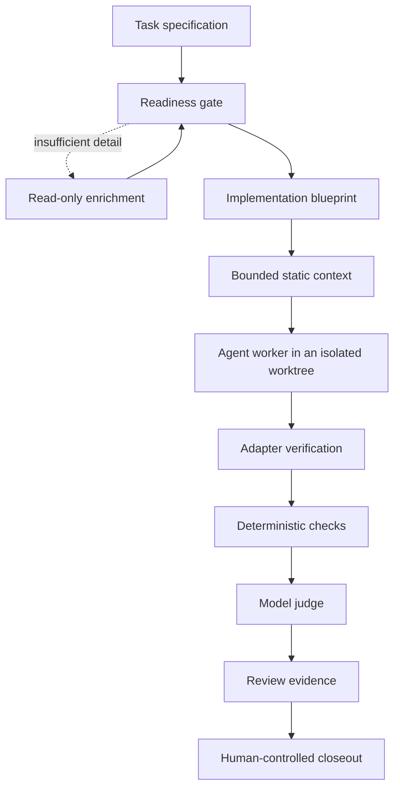
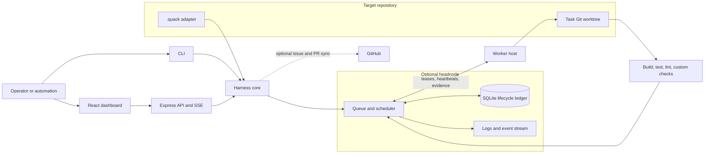
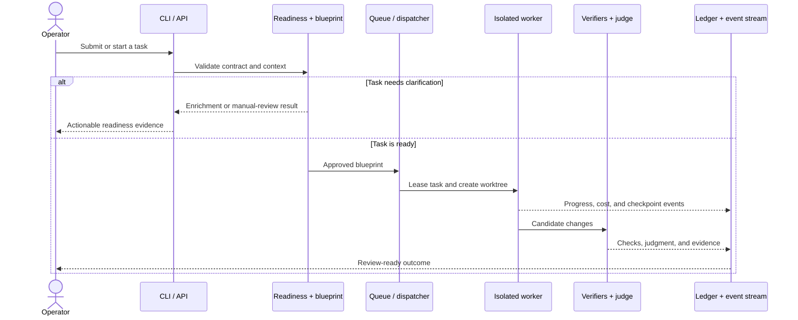
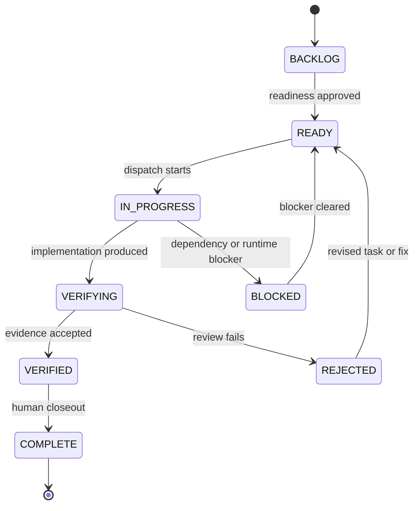

# Architecture

Quack Harness separates reusable orchestration from project-specific policy. The core understands task contracts, execution stages, verification evidence, and lifecycle state; each target repository supplies its own paths, commands, conventions, and Git policy through a `.quack/` adapter.

## System overview



For a single machine, the CLI can run this pipeline directly. For a fleet, a headnode owns queue and lifecycle state while worker hosts lease jobs, execute them in local worktrees, and return evidence.

## Runtime topology



## Task lifecycle



## State transitions



## Major components

### Task model and adapters

`src/core/` parses Markdown task specifications, validates schema, resolves task identity and state, and loads `.quack/adapter.json`. The adapter is the boundary between reusable orchestration and repository-specific behavior.

### Readiness and planning

`src/gate/` performs deterministic validation and model-assisted depth checks. `src/blueprint/` turns an accepted task into a file-level implementation plan. `src/context/` assembles a bounded, mostly static prompt package from the task, adapter, conventions, blueprint, and selected source files.

### Execution

`src/dispatcher/` creates task branches and isolated worktrees, coordinates retries and checkpoints, and enforces cost limits. `src/worker/` starts the agent session with scoped filesystem and command permissions. Hooks prevent unsafe writes and require verification evidence before a successful stop.

### Verification and judgment

Verification is layered:

1. The target adapter runs required build, test, lint, and custom checks.
2. Deterministic rules inspect the changed files and task criteria.
3. A model judge evaluates each success criterion and reports evidence.
4. A human or trusted operator decides whether to merge, revise, or reject.

`src/judge/`, `src/judgment/`, and `src/review/` implement those contracts. Passing automation is evidence, not permission to bypass repository review policy.

### Queue and federation

`src/queue/` handles dependency-aware local scheduling. `src/monitor/federation/` adds worker registration, capabilities, leases, heartbeats, event reporting, retries, and reconciliation for multi-host deployments.

The headnode is authoritative for shared queue state. Workers operate on assigned jobs and report results; they do not silently become merge authorities.

### Monitor and UI

`src/monitor/` provides the Express API, SQLite-backed lifecycle records, server-sent events, project registration, authentication, and static asset hosting. `frontend/` is the React/Vite interface consumed by the monitor.

The frontend talks to relative `/api/*` and `/v1/*` endpoints, allowing the same build to run behind a local or remote deployment boundary.

## Persistent state

Runtime state is stored outside source files wherever possible. Depending on configuration, Quack Harness records:

- task and session lifecycle rows
- queue and federation jobs
- worker registrations and leases
- verification and review evidence
- cost and failure analytics
- project registration metadata

Generated worktrees, logs, databases, caches, and credentials belong under ignored runtime directories or external configuration locations. They must not be committed.

## Extension points

- Project adapters define commands, paths, budgets, and policies.
- Custom verifier scripts can emit structured verification results.
- Deterministic checks can map task criteria to file or content rules.
- GitHub integration can import issues and publish task status.
- Monitor routes expose queue, worker, review, and health automation surfaces.

## Trust boundaries

Quack Harness can execute commands and modify repositories, so deployment should follow least privilege:

- use repository-scoped credentials
- keep provider and service tokens outside Git
- bind local monitors to loopback unless remote access is explicitly secured
- restrict adapter write paths and allowed command patterns
- isolate task work in dedicated worktrees
- require independent review before merge
- treat task text, repository content, worker reports, and remote events as untrusted input

See [SECURITY.md](SECURITY.md) for reporting and deployment guidance.

## Source layout

```text
src/
  analytics/       failure and cost analysis
  blueprint/       implementation planning
  bootstrap/       adapter generation
  cli/             command implementations
  context/         prompt context assembly
  core/            schemas, parsing, configuration, task state
  dispatcher/      branches, worktrees, retries, budgets
  gate/            readiness and enrichment
  hooks/           permission and verification guards
  integrations/    GitHub and external integration logic
  judge/            criterion evaluation
  judgment/         typed judgment and safety signals
  monitor/          API server, persistence, federation, SSE
  planner/          task generation
  queue/            dependency-aware scheduling
  review/           review bundles and documentation checks
  testing/          test selection and baselines
  worker/           agent execution and tools
frontend/           monitor UI
tests/              unit and integration tests
adapters/examples/  safe adapter examples
```
