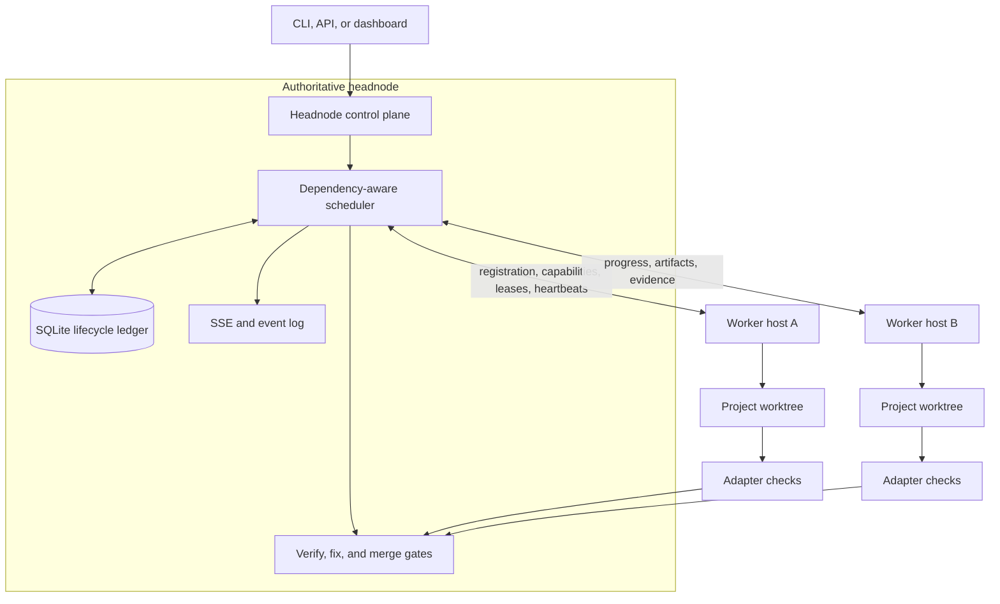
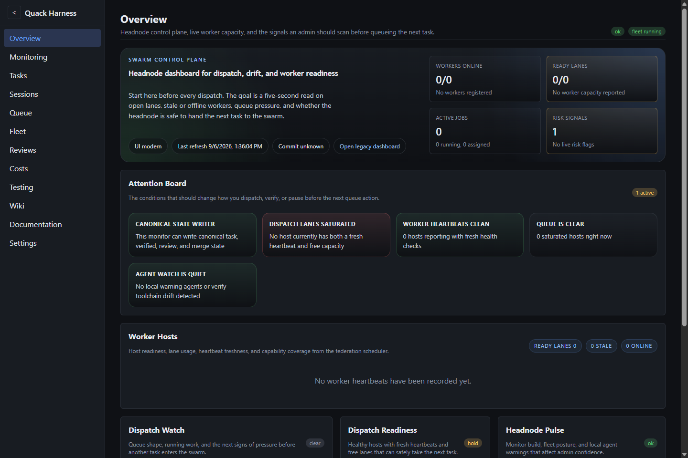
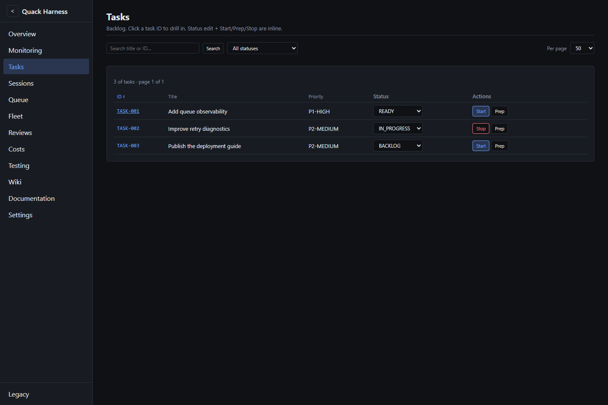
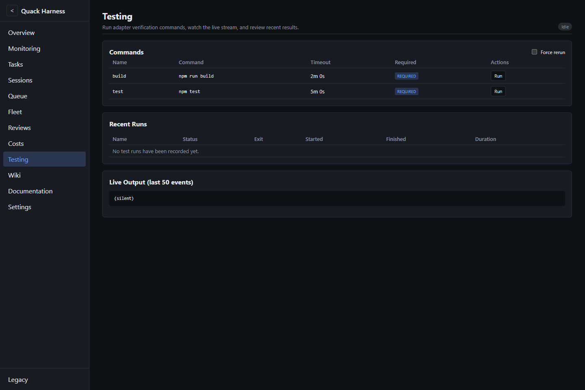
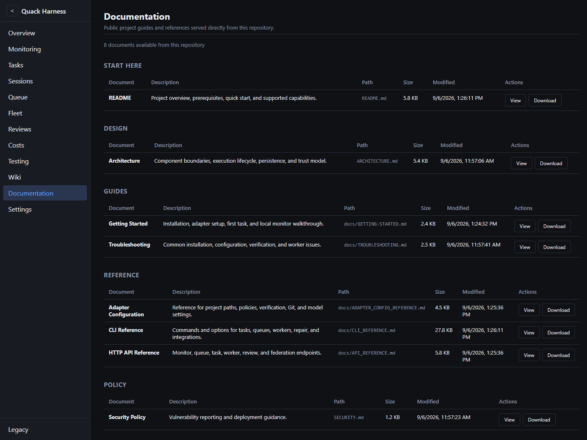
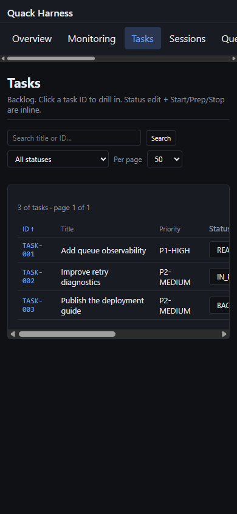

# Quack Harness

Quack Harness is a codebase-agnostic control plane for planning, executing, reviewing, and operating coding-agent work. It turns structured task specifications into isolated Git worktrees, applies project policy through adapters, and produces durable evidence before a human-controlled closeout.

The current architecture combines a Claude Agent SDK implementation worker with optional cross-model review loops powered by the Codex CLI or the Claude SDK. Deterministic safety signals remain authoritative: model judgment can add scrutiny, but it cannot override a safety stop or silently widen an approval.

> **Release status:** Quack Harness is a public, pre-`1.0` project. The core workflow is actively tested, but APIs and configuration may still change before the first stable release. See [STATUS.md](STATUS.md) for supported capabilities and current limitations.

## Why Quack Harness

Coding agents are useful, but an agent session by itself is not a delivery system. Quack Harness supplies the surrounding machinery:

- task contracts, identity checks, readiness scoring, enrichment, and decomposition
- file-level blueprints and bounded context packages
- isolated branches and Git worktrees with scoped write and command permissions
- a Claude Agent SDK worker with budgets, retries, checkpoints, and resume support
- read-only brief and diff review through either Codex CLI or Claude SDK runners
- typed judgment with deterministic safety floors and staged `off`, `shadow`, or `enforce` rollout
- adapter verification, smart test selection, optional Docker checks, and model-based judging
- persisted workflows, evidence bundles, handoff records, and operator-controlled closeout
- local queues or a federated headnode/worker topology with leases and heartbeats
- an Express/SQLite/SSE control plane and a React monitoring interface
- optional GitHub issue, status, branch, and pull-request integration

Project-specific commands and policy live in the target repository's `.quack/` adapter. The orchestration core does not assume a particular application framework.

## Architecture at a glance

```mermaid
flowchart LR
    Spec["Task contract"] --> Identity["Identity and schema checks"]
    Identity --> Gate["Readiness gate"]
    Gate -. "needs detail" .-> Enrich["Read-only enrichment"]
    Enrich --> Gate
    Gate --> Blueprint["Blueprint and fidelity audit"]
    Blueprint --> BriefReview["Read-only brief review<br/>Codex CLI or Claude SDK"]
    BriefReview --> Worktree["Isolated Git worktree"]
    Worktree --> Worker["Claude Agent SDK worker"]
    Worker --> Seal["Output seal and safety signals"]
    Seal --> Verify["Build, test, lint, and custom checks"]
    Verify --> DiffReview["Read-only diff review<br/>Codex CLI or Claude SDK"]
    DiffReview --> Judge["Judge and typed judgment"]
    Judge --> Evidence["Evidence bundle"]
    Evidence --> Human["Human-controlled closeout"]
```



The pipeline can run on one machine or through a federated control plane:



See [Architecture](ARCHITECTURE.md) for component, lifecycle, state-machine, and trust-boundary diagrams.

## Cross-model review loops

Set an adapter's `executionMode` to `loop` to place independent review gates around implementation:

1. **Brief review** checks the task contract and implementation blueprint before a build starts.
2. **Implementation** runs in an isolated worktree through the Claude Agent SDK.
3. **Diff review** examines the resulting patch and verification evidence before closeout.
4. **Retry review** applies the same diff contract to repair attempts.

Each review returns a typed `SHIP`, `AMEND`, or `FIX_FIRST` verdict with evidence anchors. A Codex-backed review is launched with a runner-constructed argument vector and a mandatory read-only sandbox. Quack records the request, bounds subprocess output and time, checks cited file anchors, and detects any new working-tree dirt. Runner failures remain typed environment failures; they are never converted into approval verdicts.

A minimal cross-model adapter section looks like this:

```json
{
  "executionMode": "loop",
  "loop": {
    "briefReview": {
      "reviewer": { "runner": "codex-cli" },
      "requireCrossModel": true
    },
    "diffReview": {
      "reviewer": { "runner": "codex-cli" },
      "requireCrossModel": true
    }
  }
}
```

The Codex CLI is optional. The same review contract can use the Claude SDK, but `requireCrossModel: true` only succeeds when the review runner is actually `codex-cli`.

## Judgment and safety model

Quack normalizes readiness, documentation review, loop review, judge, and post-judge results into one typed decision vocabulary:

- `continue`
- `repair`
- `human_review`
- `stop`

Intent judgment can be enabled per stage in `off`, `shadow`, or `enforce` mode. Shadow mode records the model candidate without changing the active decision. At loop and judge gates, enforcement is monotonic: the intent model may confirm or make a result more restrictive, never promote a result past the deterministic decision.

The safety floor dominates all model output. Built-in safety signals cover missing required schema, secret exposure, protected-branch deletion or history rewrite, production deployment, and tampering with verification machinery. Additional producers audit output seals, branch mutations, deployment-shaped commands, snapshot integrity, and authority boundaries.

## Verification and workflow control

Verification is layered rather than reduced to one model verdict:

1. Adapter commands run required build, test, lint, and custom checks.
2. Smart testing can select related tests and compare against a baseline.
3. Deterministic checks map task criteria to files, content, and safety facts.
4. The judge evaluates success criteria and records evidence.
5. Review linkage and workflow state determine whether the result is eligible for closeout.

Verify and fix operations are persisted workflows. They record phase results, attempt counts, findings, block reasons, evidence bundles, and bounded handoff data. Exhausted repair attempts stop in an explicit blocked state rather than looping indefinitely.

## Isolation and state integrity

Quack treats the task, repository, model output, and remote worker reports as untrusted inputs. Important controls include:

- one task branch and worktree per independent run
- adapter-defined writable and denied paths
- allowlisted shell command shapes with operator and chaining checks
- protected-branch mutation and deployment guards
- output snapshots and seal-conformance checks
- stale-spec and duplicate-claimant refusal before destructive lifecycle actions
- checkpoint validation before resume
- scoped credentials and authenticated mutation/federation APIs
- human merge authority by default

## Dashboard

The monitor serves a React/Vite operator interface backed by an Express API, SQLite lifecycle state, and server-sent events. Its routes cover overview, deployment monitoring, tasks, sessions, queue state, worker fleet, reviews, cost, testing, documentation, agent resources, and settings.



| Task backlog                                                                                          | Verification commands                                                                                      |
| ----------------------------------------------------------------------------------------------------- | ---------------------------------------------------------------------------------------------------------- |
|  |  |

| Repository documentation                                                                                         | Mobile task view                                                                          |
| ---------------------------------------------------------------------------------------------------------------- | ----------------------------------------------------------------------------------------- |
|  |  |

## Prerequisites

- Node.js 20.19 or newer
- npm
- Git
- An Anthropic API key for the implementation worker, planning, enrichment, and judge operations
- Optional: Codex CLI plus its configured credentials for cross-model review loops
- Optional: Docker for adapters that use containerized verification
- Optional: GitHub CLI for issue synchronization and pull-request workflows

## Quick start

```bash
git clone https://github.com/NotADevIAmaMeatPopsicle/Quack-Harness.git
cd Quack-Harness
npm ci
npm --prefix frontend ci
cp .env.example .env
```

Set `ANTHROPIC_API_KEY` in `.env`, then build and inspect the CLI:

```bash
npm run build
node dist/index.js --help
```

Create or inspect an adapter in a target project:

```bash
node dist/index.js init <PROJECT_PATH>
```

Run readiness and verification before dispatch:

```bash
node dist/index.js prep TASK-001 --project <PROJECT_PATH>
node dist/index.js preflight TASK-001 --project <PROJECT_PATH>
node dist/index.js verify TASK-001 --project <PROJECT_PATH>
node dist/index.js run TASK-001 --project <PROJECT_PATH>
```

Start the monitor on loopback:

```bash
node dist/index.js monitor --project <PROJECT_PATH> --host 127.0.0.1 --port 3333
```

Open `http://localhost:3333`. See [Getting Started](docs/GETTING-STARTED.md) for the complete first-run flow.

## CLI surface

Quack Harness includes commands for:

| Area               | Commands                                                              |
| ------------------ | --------------------------------------------------------------------- |
| Task execution     | `run`, `wave`, `prep`, `preflight`, `verify`, `enrich`, `revise`      |
| Task authoring     | `plan`, `decompose`, `templates`                                      |
| Operations         | `monitor`, `status`, `projects`, `queue`, `overnight`                 |
| Worker fleet       | `worker-runtime`, `worker runtime`, `worker enroll`, `worker install` |
| State repair       | `repair-specs`, `repair-db`, `repair-state`                           |
| GitHub integration | `import`, `publish`, `sync`                                           |

See the [CLI reference](docs/CLI_REFERENCE.md) for flags, safety behavior, and examples.

## Project adapters

Quack Harness reads project policy from `<PROJECT_PATH>/.quack/adapter.json`. An adapter can define:

- task, source, test, and conventions directories
- writable and denied paths plus allowed and denied command patterns
- build, test, lint, Docker, and custom verification commands
- worker, planner, enrichment, reviewer, and judge models
- direct or loop execution mode and brief/diff review policy
- judgment rollout and safety-floor settings
- Git branch, push, pull-request, and merge behavior
- retry, budget, queue, worktree, and preflight limits
- worker profiles and federation capabilities

Start with [`adapters/examples/node-typescript/`](adapters/examples/node-typescript/) and the [adapter reference](docs/ADAPTER_CONFIG_REFERENCE.md). Use placeholders such as `<PROJECT_PATH>`, `<PORT>`, and `example.test` in shared configuration.

Secrets belong in environment variables or an external secret store. Do not commit `.env`, service tokens, provider keys, or credential-bearing URLs.

## Repository map

| Path                               | Purpose                                                        |
| ---------------------------------- | -------------------------------------------------------------- |
| `src/core/`                        | Task parsing, identity, schemas, adapter loading, and state    |
| `src/gate/`                        | Readiness evaluation and enrichment                            |
| `src/blueprint/`                   | Implementation planning and fidelity auditing                  |
| `src/context/`                     | Static context assembly and token-budget trimming              |
| `src/worker/`                      | Claude Agent SDK execution, permissions, hooks, and tools      |
| `src/dispatcher/`                  | Worktrees, retries, branches, checkpoints, seals, and budgets  |
| `src/review/`                      | Codex CLI/Claude SDK brief and diff review loops               |
| `src/judge/` and `src/judgment/`   | Criteria evaluation, typed decisions, and safety signals       |
| `src/workflows/`                   | Persisted verify/fix workflows and handoff state               |
| `src/queue/` and `src/federation/` | Dependency scheduling and worker routing                       |
| `src/monitor/`                     | HTTP APIs, SQLite persistence, federation, SSE, and UI hosting |
| `frontend/`                        | React/Vite operator interface                                  |
| `tests/`                           | Unit, integration, security regression, and UI tests           |
| `adapters/examples/`               | Safe example project adapters                                  |

## Current limitations

- Agent-backed commands require provider credentials and may incur API charges.
- Codex cross-model review requires a separately installed and authenticated Codex CLI.
- Docker verification is adapter-dependent and requires a working Docker installation.
- Distributed mode requires explicit network, authentication, repository-access, and worker-enrollment configuration.
- The API and adapter schema may change before a stable `1.0` release.
- Hardware-specific, production-deployment, and multi-host behavior must be validated in the environment where it will run.

## Documentation

- [Getting Started](docs/GETTING-STARTED.md)
- [Architecture](ARCHITECTURE.md)
- [CLI Reference](docs/CLI_REFERENCE.md)
- [HTTP API Reference](docs/API_REFERENCE.md)
- [Adapter Configuration](docs/ADAPTER_CONFIG_REFERENCE.md)
- [Monitor Guide](docs/MONITOR_GUIDE.md)
- [SSE Events](docs/SSE_EVENTS_REFERENCE.md)
- [Troubleshooting](docs/TROUBLESHOOTING.md)
- [Project Status](STATUS.md)
- [Contributing](CONTRIBUTING.md)
- [Security Policy](SECURITY.md)

## Contributing and license

Please read [CONTRIBUTING.md](CONTRIBUTING.md) before opening a change and report security issues through the process in [SECURITY.md](SECURITY.md).

Quack Harness is licensed under the [GNU Affero General Public License v3.0](LICENSE) (`AGPL-3.0-only`). Personal and commercial use, modification, and redistribution are allowed under its terms. If you modify the software and let users interact with it over a network, you must offer those users the corresponding source. The license does not grant rights to the Quack Harness name or branding as trademarks.
